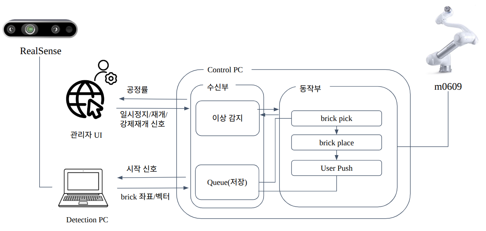
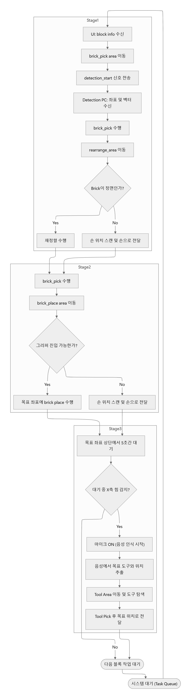

# JIUM (지음)

AI(CV) 기반 협동 로봇(Doosan M0609)이 Intel RealSense로 레고 블록을 인식하고,  
사용자 도면에 따라 자동으로 pick & place 하는 협동 건축 시스템

---

## 시스템 구조



---

## 동작 플로우차트



---

## 요구사항

### Control PC

- Ubuntu 22.04
- ROS2 Humble
- Node.js 18+ (ZIUM_UI)

```bash
sudo apt update

# ROS2 Humble 필수 패키지
sudo apt install ros-humble-rosbridge-server
sudo apt install ros-humble-sensor-msgs
sudo apt install ros-humble-cv-bridge

# 그리퍼 드라이버 의존성
pip3 install pymodbus==3.3.2

# pick2build Python 의존성
pip3 install -r ZIUM_Control/requirements.txt
```

### Detection PC

- Ubuntu 20.04
- Docker (NVIDIA Container Toolkit 포함)
- CUDA 11.x 이상
- ROS Foxy (Docker 컨테이너 내부)
- Intel RealSense SDK 2.0

---

## 사전 조건 (Real 모드)

> - 로봇 IP: `192.168.1.100`
> - 그리퍼 Modbus IP: `192.168.1.1` (OnRobot Compute Box, 고정)
> - Control PC와 Detection PC는 동일 LAN에 연결되어야 함
> - `ROS_DOMAIN_ID`를 양쪽 동일하게 설정해야 DDS 통신이 가능
>
> UDP 포트 권한 설정 (Control PC, 최초 1회):
> ```bash
> sudo sysctl -w net.ipv4.ip_unprivileged_port_start=0
> echo 'net.ipv4.ip_unprivileged_port_start=0' | sudo tee /etc/sysctl.d/99-ros2-doosan.conf
> ```

---

## 의존성 패키지 설치

`od_msg` (커스텀 서비스 메시지)는 이 레포지토리의 `ZIUM_Control/od_msg/`에 포함되어 있다.  
`dsr_msgs2`는 아래 Doosan 패키지 안에 포함되어 있다.

```bash
cd ~/cobot2_block_construction/ZIUM_Control

# Doosan 공식 패키지 (dsr_msgs2 포함)
git clone https://github.com/doosan-robotics/doosan-robot2
```

---

## RealSense 초기 설정 (최초 1회)

udev rules가 없으면 스트리밍 중 `xioctl(VIDIOC_QBUF) failed` 에러가 발생한다.

```bash
sudo curl https://raw.githubusercontent.com/IntelRealSense/librealsense/master/config/99-realsense-libusb.rules \
  -o /etc/udev/rules.d/99-realsense-libusb.rules
sudo udevadm control --reload-rules && sudo udevadm trigger
```

적용 후 USB 재연결 필요.

---

## 빌드

### Control PC

```bash
cd ~/cobot2_block_construction/ZIUM_Control
source /opt/ros/humble/setup.bash
colcon build
source install/setup.bash
```

### Detection PC (Docker 내부)

```bash
# Docker 컨테이너 진입 후
cd /path/to/ZIUM_Detection
source /opt/ros/foxy/setup.bash
colcon build
source install/setup.bash
```

### UI

```bash
cd ~/cobot2_block_construction/ZIUM_UI
npm install
npm run dev
```

---

## 실행

### 1. Detection PC — FoundationPose 노드 시작

```bash
# Docker 컨테이너 내부
source /opt/ros/foxy/setup.bash
source install/setup.bash

conda activate my
ros2 run zium_detection foundation_pose \
    --est_refine_iter 20 \
    --track_refine_iter 20
```

### 2. Control PC — 시스템 런치

```bash
source /opt/ros/humble/setup.bash
source ~/cobot2_block_construction/ZIUM_Control/install/setup.bash

ros2 launch pick2build run_system.launch.py
```

런치 파일은 아래 노드를 동시에 실행한다:

| 노드 | 역할 |
|------|------|
| `stage_place` | TopicListenerNode (토픽 수신) + RobotWorkerNode (pick/place/push), RobotSharedState 공유 |
| `detection` | ObjectDetectionNode — `/get_3d_position` 서비스 |
| `get_keyword` | GetKeyword — `/get_keyword` 서비스 (STT + LLM) |

### 3. UI 시작

```bash
cd ~/cobot2_block_construction/ZIUM_UI
npm run dev
```

브라우저에서 `http://localhost:5173` 접속.

---

## ROS2 토픽 인터페이스

### Control PC ↔ Detection PC

| 토픽 | 타입 | 방향 | 설명 |
|------|------|------|------|
| `/dsr01/detection_start` | `std_msgs/Int32` | Control → Detection | 감지 시작 트리거 (블록 ID: 0·1·2) |
| `/dsr01/target_lego_pose` | `std_msgs/Float64MultiArray` | Detection → Control | 블록 6-DoF 포즈 `[x, y, z, roll, pitch, yaw, pose_code]` (mm·deg) |

`pose_code`: `0.0`=UPRIGHT, `1.0`=INVERTED, `2.0`=SIDE, `3.0`=FRONT

### Admin UI ↔ Control PC (rosbridge WebSocket)

| 토픽 | 타입 | 방향 | 설명 |
|------|------|------|------|
| `/block/info` | `std_msgs/String` (JSON) | UI → Control | 블록 배치 도면 정보 |
| `/signal_id` | `std_msgs/Int32` | UI → Control | 작업 시작 신호 |
| `/signal_stop` | `std_msgs/Int32` | UI → Control | 일시정지 |
| `/signal_start` | `std_msgs/Int32` | UI → Control | 재개 |
| `/signal_unlock` | `std_msgs/Int32` | UI → Control | 강제 재개 (E-Stop 해제) |

### pick2build 내부 서비스

| 서비스 | 타입 | 제공 노드 | 설명 |
|--------|------|-----------|------|
| `/get_3d_position` | `od_msg/SrvDepthPosition` | `detection` | Control PC 카메라 기반 3D 좌표 반환 |
| `/get_keyword` | `std_srvs/Trigger` | `get_keyword` | 음성 명령 → 키워드 추출 |

### Detection PC 카메라 토픽 (RealSense, DDS 브로드캐스트)

| 토픽 | 타입 | 설명 |
|------|------|------|
| `/dsr01/camera/color/image_raw` | `sensor_msgs/Image` | RGB 컬러 이미지 |
| `/dsr01/camera/aligned_depth_to_color/image_raw` | `sensor_msgs/Image` | 컬러 정렬 뎁스 이미지 |
| `/dsr01/camera/color/camera_info` | `sensor_msgs/CameraInfo` | 카메라 내부 파라미터 |

---

## 디렉토리 구조

```
cobot2_block_construction/
│
├── ZIUM_Control/                        # Control PC 워크스페이스
│   ├── requirements.txt                 # pip 의존성 (rosdep 미포함 패키지)
│   ├── od_msg/                          # 커스텀 서비스 메시지 패키지
│   │   └── srv/
│   │       └── SrvDepthPosition.srv     # string target / float64[] depth_position
│   └── pick2build/                      # ROS2 패키지 (ament_python)
│       ├── launch/
│       │   └── run_system.launch.py     # stage_place + detection + get_keyword 실행
│       ├── pick2build/
│       │   ├── stage_place.py           # 메인 오케스트레이터 (RobotWorkerNode: pick/place/push)
│       │   ├── topic_listener.py        # TopicListenerNode — /block/info, 제어 신호 수신
│       │   ├── shared_state.py          # RobotSharedState — 노드 간 공유 상태 (Queue, pause 플래그)
│       │   ├── config/
│       │   │   └── robot_params.yaml    # 로봇 좌표·force threshold·블록 파라미터 (캘리브레이션 설정)
│       │   ├── detection.py             # 물체·손 감지 노드 (YOLO + MediaPipe)
│       │   ├── get_keyword.py           # 음성 명령 추출 노드 (Whisper STT + GPT-4o)
│       │   ├── realsense.py             # 카메라 토픽 구독 헬퍼 (ImgNode)
│       │   ├── yolo.py                  # YOLO 모델 래퍼 (YoloModel)
│       │   ├── stt.py                   # OpenAI Whisper STT 헬퍼
│       │   ├── MicController.py         # PyAudio 마이크 스트림 관리
│       │   └── onrobot.py               # RG2 그리퍼 Modbus TCP 제어
│       ├── resource/
│       │   └── .env                     # OPENAI_API_KEY, TOOLCHARGER_IP, TOOLCHARGER_PORT
│       ├── package.xml
│       └── setup.py
│
├── ZIUM_Detection/                      # ROS2 패키지 `zium_detection` (ament_python, ROS Foxy, Docker)
│   ├── zium_detection/
│   │   └── FoundationPose.py            # 6-DoF 포즈 추정 노드 (YOLO + FoundationPose)
│   ├── FoundationPose-main/
│   │   ├── estimater.py                 # FoundationPose 추정기 라이브러리
│   │   ├── weights/
│   │   │   └── T_gripper2camera.npy     # 그리퍼↔카메라 외부 보정 행렬 (best.pt는 gitignore)
│   │   └── demo_data/lego/
│   │       ├── cam_K.txt                # 카메라 내부 파라미터 (fallback)
│   │       └── mesh/                    # 블록 3D 메시 파일 (0.obj, 1.obj, 2.obj)
│   ├── package.xml
│   └── setup.py
│
├── ZIUM_UI/                             # 관리자 대시보드
│   └── src/
│       ├── App.jsx                      # 메인 React 컴포넌트
│       └── main.jsx                     # 엔트리포인트
│
├── assets/
│   ├── system.png                       # 시스템 구성도
│   └── flowchart.jpg                    # 동작 플로우차트
│
└── .gitignore
```
